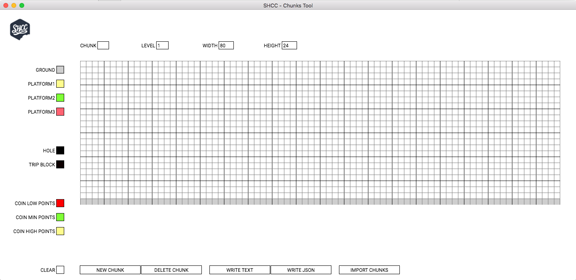
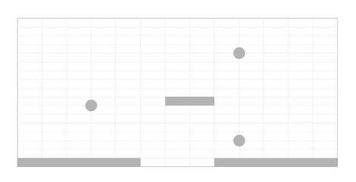
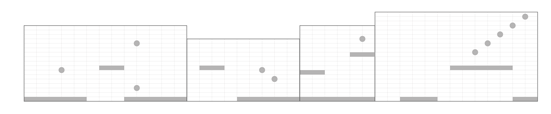
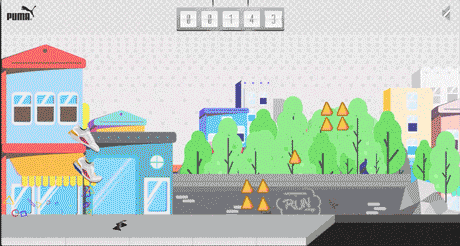

# chunks-tool
2D Runner-style JSON game level generator

Chunks Tool is a electron application for a specific task of building level components for 2D runner-style games. This tool was used in development of the Puma RS-0 Play The Game application.

To run :
```sh
npm i
npm run start
```



## A Little Background...

To create our generative landscape, we initially began with a number of simple platforms and coins distributed randomly as the game progressed. By focusing on quick release cycles and prototypes we quickly realized the limitations in this approach, we just didn’t have enough control over the difficulty and the randomness felt too obvious. If a game is going to be immersive the user needs to have a certain level of faith that the game designers have thought through the ins-and-outs. If the game play is too obvious or too simple it becomes a distraction. We thought that if we could predefined chunks of level we would be able to mix and match pieces to create a unique and seemingly random experience.



Designing individual chunks, we had much greater control over creating challenging actions, bite-sized challenges which the user needed to solve.



Often when creating experiences and games, it become necessary to develop tools or software to facilitate the process of design and/or development. The need for this game became to create a tool that our design/ux team could use to could use to design and edit our chunks. An exported configuration file which would then be digested in the application and used to dictate the gameplay.

